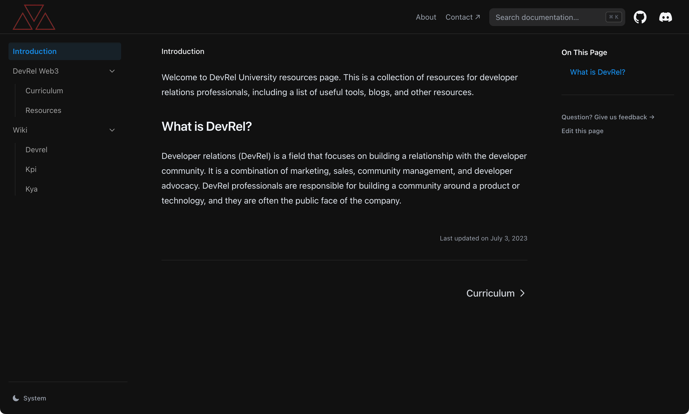

# DevRel Resources

Welcome to the DevRel Resources repository! This collaborative hub, born from the DevRel University Captain Program, is dedicated to curating and sharing valuable resources for Developer Relations professionals. As a Developer Relations (DevRel) practitioner, you understand the importance of having access to a diverse range of materials, including articles, tutorials, videos, tools, frameworks, and best practices.

Our goal is to create a comprehensive and up-to-date resource library that empowers DevRels in their roles. By pooling our collective knowledge and expertise, we can support and enhance the work of Developer Relations professionals.

## Contributing to the Repository

We encourage you to contribute to this repository by sharing resources that you find valuable or creating new materials. Whether you have come across an insightful article, discovered a useful tool or framework, or have created content that you believe would benefit the DevRel community, we welcome your contributions!

To contribute to the repository, follow these steps:

1. Fork this repository to your own GitHub account.
2. Create a new branch with a descriptive name for your contribution.
3. Add your resources to the appropriate folders or create new ones if needed.
4. Commit and push your changes to your forked repository.
5. Open a pull request to have your changes reviewed and merged into the main repository.

Please ensure that your contributions align with our community guidelines and code of conduct. Let's foster an inclusive and welcoming environment for all DevRels.

## Resource Categories

Resources in this repository are organized into different categories for easy navigation and discovery. Here are the existing resource categories available:

- [Communication](https://github.com/0xwaya/devreluni_rss/tree/main/pages/resources/communication)
- [Content Creation](https://github.com/0xwaya/devreluni_rss/tree/main/pages/resources/content_creation)
- [DevRelUni](https://github.com/0xwaya/devreluni_rss/tree/main/pages/resources/devreluni)
- [Events](https://github.com/0xwaya/devreluni_rss/tree/main/pages/resources/events)
- [Performance](https://github.com/0xwaya/devreluni_rss/tree/main/pages/resources/performance)
- [Social Media](https://github.com/0xwaya/devreluni_rss/tree/main/pages/resources/social_media)
- [Technical](https://github.com/0xwaya/devreluni_rss/tree/main/pages/resources/technical)

Feel free to explore these categories and discover resources that interest you. If you cannot find what you are looking for, consider adding new resources or creating a new category that addresses your specific needs.

## Stay Connected

We invite you to stay connected with the DevRel community by contributing to this repository, engaging in discussions, and sharing your experiences. Together, we can build a thriving and supportive network of Developer Relations professionals.

Thank you for your contributions, and let's empower DevRels and elevate the field together!

This page was built with  [Nextra](https://nextra.site).

[**Resource page Live Demo →**](https://dru-resources.vercel.app)

## License

This project is licensed under the MIT License.

